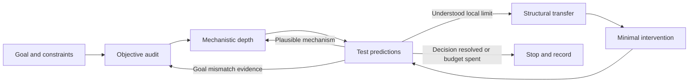

# Codex Discovery Skills

Most AI systems are good at optimizing the problem they are given. Hard research often requires deciding whether it is the right problem in the first place.

**Human-inspired structured reasoning for open-ended discovery.** Four composable Codex skills help distinguish a wrong objective from an insufficient solution, deepen plausible mechanisms, and transfer structure across domains when local progress reaches a real limit. This is a research workflow, not a claim of measured performance improvement.



The arrows are conditional. A clear routine task should not be turned into a research program.

## Design principles

- Keep objective mismatch and solution insufficiency as competing explanations.
- Audit enough to choose an action; do not reframe indefinitely.
- Deepen a plausible mechanism, but honor valid kill criteria.
- Transfer causal relationships and constraints, not vocabulary.
- Prefer the smallest informative test and preserve explicit user priorities.
- Record assumptions, tests, evidence, and conclusions without requesting private chain-of-thought.

## Installation

In Codex, invoke the built-in installer with this request (after the repository is published):

```text
Use $skill-installer to install from yuji-tt/codex-discovery-skills:
skills/objective-audit
skills/research-deepener
skills/structural-transfer
skills/discovery-loop
```

Alternatively, run the installed official helper. This POSIX-shell example assumes the default Codex home; on Windows use the equivalent path under your user profile and `python`:

```sh
python3 "${CODEX_HOME:-$HOME/.codex}/skills/.system/skill-installer/scripts/install-skill-from-github.py" --repo yuji-tt/codex-discovery-skills --path skills/objective-audit skills/research-deepener skills/structural-transfer skills/discovery-loop
```

The installed helper supports multiple paths and an optional `--ref` for a reviewed commit or tag. It refuses to overwrite existing destination directories. Skills are available on the next turn according to the installed installer instructions. Install all four for orchestration or select individual skills; discovery-loop also includes a standalone fallback. See [official skill documentation](https://developers.openai.com/codex/skills/).

## Skills

| Skill | Use when | Result |
|---|---|---|
| [objective-audit](skills/objective-audit/SKILL.md) | Proxy gains may not advance the goal | A goal/metric map and discriminating diagnostic |
| [research-deepener](skills/research-deepener/SKILL.md) | A plausible idea needs mechanistic understanding | Predictions, ablations, and bounded persistence |
| [structural-transfer](skills/structural-transfer/SKILL.md) | A distant mechanism may resolve an understood limitation | Explicit mapping and falsifiable intervention |
| [discovery-loop](skills/discovery-loop/SKILL.md) | An open-ended problem needs its next experiment | Conditional routing and an evidence-based next action |

```text
Use discovery-loop to investigate why this algorithm has plateaued.
Use objective-audit before optimizing this metric further.
Use research-deepener to distinguish a broken implementation from a false mechanism.
Use structural-transfer to look for mechanisms outside the immediate literature.
```

## Why this is different from brainstorming

An attractive analogy is not a result. Each transfer must identify a source mechanism, preserve relevant causal relationships in a target mapping, produce an implementable intervention, and predict an observation that could falsify it. Depth requires testing how a mechanism works; objective auditing requires evidence that separates misalignment from method weakness. Lists of creative-sounding ideas satisfy none of these requirements.

## Examples

These are explicitly synthetic decision records, not experimental findings:

- [Algorithm design](examples/algorithm-design.md): retain the objective and deepen optimization.
- [Scientific research](examples/scientific-research.md): transfer a coding principle into assay design.
- [Product design](examples/product-design.md): expose a pathological support metric.

## Evaluation

[Cases](evals/cases.yaml) cover multiple domains and both appropriate and inappropriate pivots. The [rubric](evals/RUBRIC.md) defines nine observable dimensions. The credential-free [harness](evals/run.py) prepares blinded prompts and aggregates human-reviewed scores; it does not pretend to automatically measure reasoning quality. No model benchmark scores are claimed.

```sh
python -m pip install -r requirements-dev.txt
python scripts/validate.py
python -m unittest discover -s tests
python evals/run.py prepare --out .eval-runs/prompts
```

Run the prepared prompts in fresh Codex tasks, record outputs, and score them using the rubric. See the rubric for a paired baseline protocol and the aggregation command. CI validates repository integrity and harness behavior, not model performance.

## Contributing

See [CONTRIBUTING.md](CONTRIBUTING.md) for structural validation and behavioral evaluation requirements and [AGENTS.md](AGENTS.md) for Codex contribution instructions.

## License

[MIT](LICENSE).
